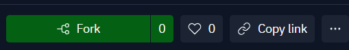
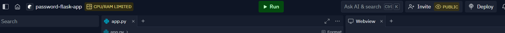
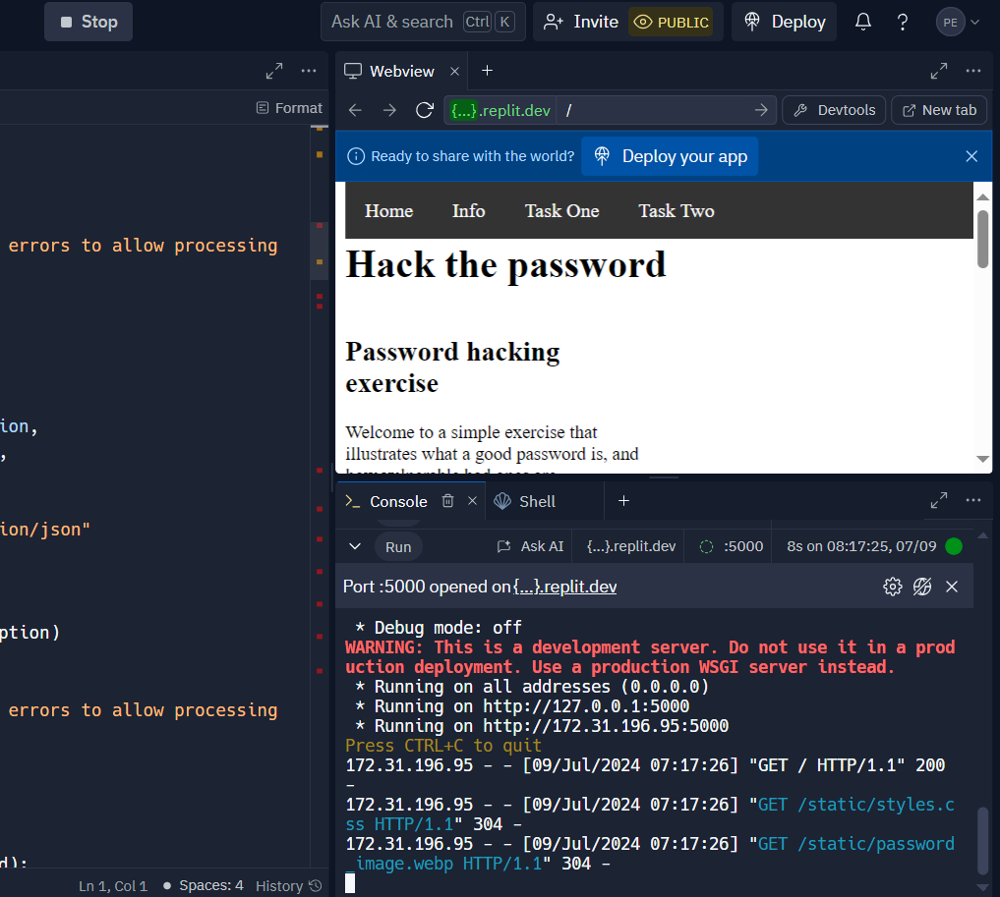
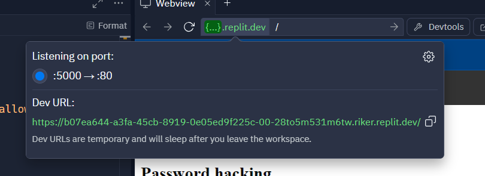
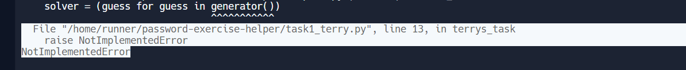

# Teacher Worksheet

This worksheet uses replit to host an app where the password can be cracked.
The first task is to run the app.

## Setup
* Navigate to the replit [repl](https://replit.com/@ppratt1/password-flask-app)
* Click Fork 

* Click create an account if not already
* Once forked run the app by clicking `Run`

* Once running you should see

* Click on the url at the top in green, and click on the double window icon or manually copy the url

* Now you can use the app like any other website in a normal browser.

NOTE: If you stop and restart the app, the url will change.
NOTE: When a user is trying to access the Flask app you will see a lot of 401s, this is to be expected as the users try to guess the flask passwords.


## Tasks
The tasks can be done via replit. For this though, each student will need to create a replit task.
Or they can run it locally. Below we describe it running in replit, instructions for local use can be found within the replit README.md.

* Navigate to [replit](https://replit.com/@ppratt1/password-exercise-helper)
* Click Fork 

* Click create an account if not already
* Navigate tot he file `main.py`.
```py
BASE_URL = "http://localhost:5000"
```
Replace `http://localhost:5000` with the long URL address the teacher has given you.
* Once done run the app by clicking `Run`

You should get the error:

* Navigate to `task1_boyle.png`
This function needs to return something other than an error, the URL your teacher has given you has more information under `task1` heading.
* Once you have changed the function try to run again.
Do this until you get a success (correctly guess the password pin).
* Once complete, in `main.py` uncomment the next lines that contain `terry` in it.
* Repeat the uncommenting of lines and tasks, until task1 and task2 are both complete. 
You have both secrets and you have created a strong password in task 2.
